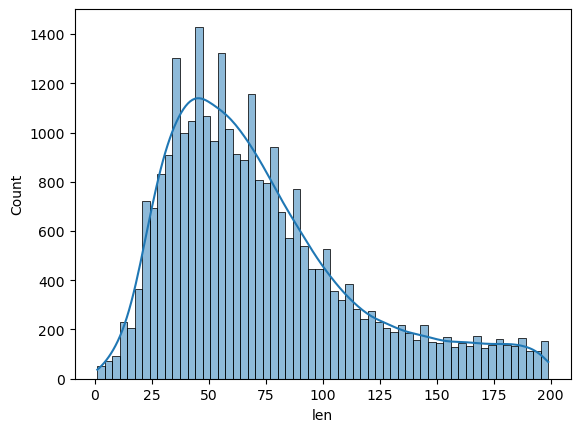
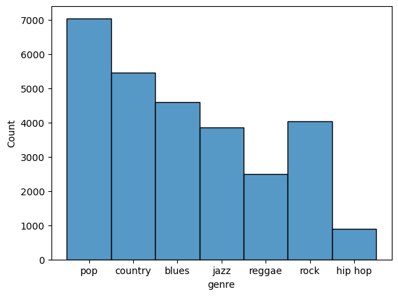
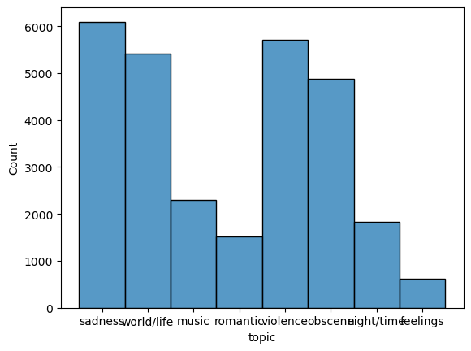
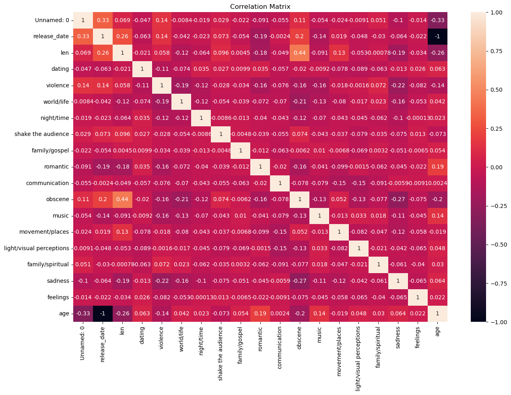

# Audio-Recommendation-Algorithm
Using an unsupervised learning algorithm on an unlabeled music dataset in order to generate clusters to recommend music

# Summary

Within this project, I was tasked with using a dataset of unlabeled song data in order to train a KMeans clustering model to generate clusters for song recommendations. I first had to perform exploratory data analysis to examine the relationships between the different features, since there was no target. Next, I cleaned the data by removing columns that were not relevant to my approach as well as generating one hot encodings for the columns that were categorical. Finally I scaled the dataset and trained a k means clustering algorithm. I used an elbow plot to find the optimal number of clusters and retrained the model. The dataset contained information such as song and artist name, release data as well as certain columns that had a scale from 0 to 1 describing whether a song was sad, happy violent etc.

 
# EDA

In the 1st step, I conducted exploratory data analysis. I viewed the dataframe and used the describe method to view the tukey statistics on this dataframe. Then I conducted univariate and bivariate analysis by generating visualizations to get an idea of the distribution of the data and the relationship between features. 

The len column, which represents the length of the songs, shows a right skewed distrbution. Most song lengths are concentrated between 25-100

I also noticed that A vast majority of the songs seem to be either pop or country, with blues being a close second. The hip hop genre has the least amount of songs in this dataset

Another important observation is that songs about feelings make up around 500 songs in this dataaset while the largest category seems to be sadness which has more than 6000 songs.

There is no observable unusually large correlation, although I did observe that the correlation between len and obscene was around 0.44.

# Data Cleaning and Transformation
In the next step, I was tasked with conducting data transformation and cleaning. I checked the dataframe for missing values using df.isna().sum(). The results showed me that there were no missing values in the dataframe. I also had to transform both the test and training set together. I removed certain columns such as song and artist name as well as len because I wanted to focus on the columns that described song content rather than information like name, artist name and release date. I also dropped the lyrics column. I then had to generate one hot encodings for the genre and topic columns since they were not numeric. I finished by updating the respective csv files and moving on to the modeling stage.

# Modeling
Before modeling the data, I had to scale the data to make sure all data points were relative to the same range and scale. Then, I instantiated a default kmeans model on the training dataset and used an elbow plot to find the optimal number of clusters. Since the optimal clusters were 8, I trained another kmeans model with 8 clusters. Next, I generated labels for the training set and saved them for future analysis. I had to now generate clusters for the test set, but there were some issues. Firstly, I had to generate dummy columns because 3 one hot encoded columns were missing in the test set, due to the test set being just 10 samples so it could not cover all topics and genres. There was also an extra column which i dropped and finally i reordered the columns to match the training set. After generating labels for the test set, I saved them to the csv file for further analysis.

# Analysis
In order to analyze the datasets with the labels, I decided to split the cluisters into seperate dataframes and analyze a sample of 5 songs per cluster. I also analyzed the test set in order to see which clusters each of the 10 songs was placed in

# Next Steps
Potential next steps for this dataset and model would be to gather more music data. I would also want to use more samples for the test set and possibly try to generate less clusters to see how the model would group the data. For me personally, a goal or next step would be to conduct further research into this topic and gain a deeper understanding of the features and their meaning as well as more information on unsupervised learning and kmeans models.